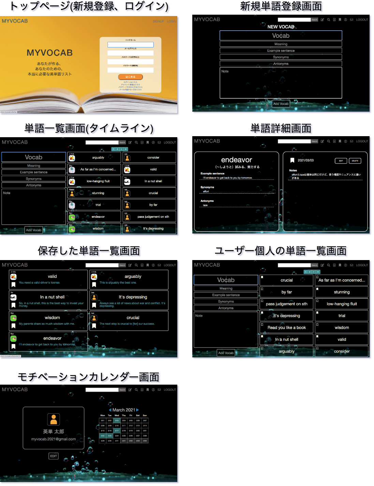
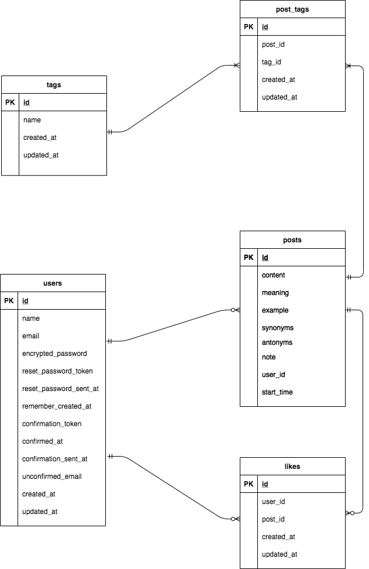

# MYVOCAB

思い立った時に英単語をメモし、アプリ内でリストを共有・検索できるアプリです。

URL: http://www.myvocab.site/

## アプリ概要

こちらのアプリのコンセプトは、以下の2つです。

1. 自分に本当に必要な英単語だけが入った単語帳を作れる
2. 他ユーザーのリストから例文などを辞書代わりとして閲覧できる

自分で作るオリジナルの英単語帳「MYVOCAB」というサービスを開発しました。

基本的なCRUD処理が可能となっている英単語SNSですが、その他に以下のような特徴のあるアプリです。

- githubの「草」のように、英単語を追加した日のカレンダーの色が変わる

このカレンダーは他ユーザーにも公開されており、モチベーションの維持と継続を計っています。

## 開発した背景

> あ、この英単語メモしておきたい!  
（メモ帳アプリに箇条書きされた英単語たち）  
 数日後...  
 あの時の単語なんだったっけ?  
 『なんの単語かも忘れたし、どこにメモしたかも忘れた orz 』

 英語学習をしていると、このような状況に何回も遭遇しました。

 - 市販の単語帳は実際に使わない単語もたくさん掲載されている
 - メモ帳アプリにメモするだけだと見づらく効率が悪い
 - この英単語の例文を、みんなはどう作っているんだろう?

これらを解決し、より便利に英語学習をするために

 - 本当に自分が必要としている英単語だけを集められる単語帳
 - 例文や類義語、対義語そして記憶定着力向上のための一言ノートを一纏めに
 - アプリ内で単語量が増えるとアプリ自体がみんなの辞書になる

このような経験から、英語学習者の悩みを少しでも解消できればと思い
単語帳アプリを作ってみたいと考えた背景があります。

## 使用画面のイメージ

## 使用技術

- フロントエンド
  - jQuery (バージョン)
  - HTML/CSS/Sass/Bootstrap

- バックエンド
  - Ruby 2.6.6
  - Ruby on Rails 6.0.3.5

- インフラ
  - Nginx 1.16.1
  - MySQL 8.0.23
  - Unicorn 5.8.0
  - AWS ( EC2, EIP, VPC, IAM, Route53 )

- その他使用ツール
  - Atom

## 機能一覧

- **ユーザー登録関連**
  - 新規登録、プロフィール編集機能
  - ログイン、ログアウト機能
  - メール認証機能

- **ユーザー投稿関連(CRUD)**

- **クイック投稿**
  - 新規投稿ページとは別に一覧ページに新規投稿フォームの設置

- **ユーザープロフィール編集機能**

- **パスワード変更機能**

- **ブックマーク機能**

- **検索機能**
  - アプリ内の英単語から検索
  - 部分一致

- **フラッシュメッセージ表示機能**
  - 投稿、編集、削除、ログイン、ログアウト時にフラッシュメッセージを表示

- **エラーメッセージ表示機能**
  - 新規登録、ログイン、投稿、編集時にエラーメッセージを表示

- **ページネーション機能**
  - 検索結果、個人の英単語リスト一覧、ブックマーク英単語一覧

- **画像アップロード機能**

- **レスポンシブ対応**

- **今後追加していく機能**
  - 無限スクロール機能  
    - モバイルユーザーの使いやすさ向上のため
  - フォロー機能
  - 英単語のカテゴリ検索機能

## DB設計

### ER図

### 各テーブルについて

| テーブル名 | 説明 |
----|----
| users | 登録ユーザー情報 |
| posts | 投稿された英単語の情報 |
|likes|ブークマークされた英単語の情報|
